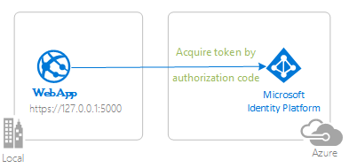
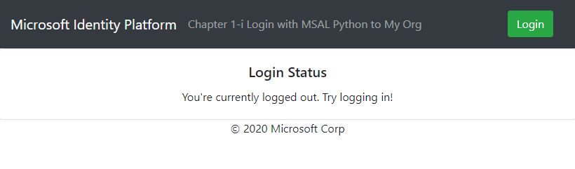

# A Python Flask Webapp for logging in users in your organization with the Microsoft Identity platform

 1. [Overview](#overview)
 1. [Scenario](#scenario)
 1. [Contents](#contents)
 1. [Prerequisites](#prerequisites)
 1. [Setup](#setup)
 1. [Registration](#registration)
 1. [Running the sample](#running-the-sample)
 1. [Explore the sample](#explore-the-sample)
 1. [About the code](#about-the-code)
 1. [More information](#more-information)
 1. [Community Help and Support](#community-help-and-support)
 1. [Contributing](#contributing)
 1. [Code of Conduct](#code-of-conduct)


## Overview



This Sample demonstrates a Python Flask Webapp for logging in users in your organization using Azure Active Directory.

1. The Python Flask Webapp application uses the Microsoft Authentication Library (MSAL) for Python to obtain an authorization code from Azure Active Directory (Azure AD)
1. The code is sent back to AAD by the user's browser and exchanged for a JWT-encoded ID token
1. The ID token is used to authenticate the user and log them in to the webapp, maintaining their logged-in status in the app session.

## Scenario

- This sample shows how to build a Flask Web app that uses OpenID Connect to sign in users.
- Users can only sign-in with their work and school accounts in their own organization.



## Contents

| File/folder       | Description                                |
|-------------------|--------------------------------------------|
|`AppCreationScripts/`| Folder contains scripts to configure and dismantle AzureAD apps|
|`i_oidc_my_org.py` | The sample app code.                       |
|`auth_endpoints.py`| The auth related endpoints code.           |
| `CHANGELOG.md`    | List of changes to the sample.             |
| `CONTRIBUTING.md` | Guidelines for contributing to the sample. |
| `LICENSE`         | The license for the sample.                |

## Prerequisites


- Python 3
- A virtual environment to install packages from requirements.txt
- An Azure Active Directory (Azure AD) tenant. For more information on how to get an Azure AD tenant, see [How to get an Azure AD tenant](https://azure.microsoft.com/documentation/articles/active-directory-howto-tenant/)
- A user account in your Azure AD tenant. This sample will not work with a **personal Microsoft account**. Therefore, if you signed in to the [Azure portal](https://portal.azure.com) with a personal account and have never created a user account in your directory before, you need to do that now.


## Setup

### Step 1: Clone the repository

From your shell or command line:

```Shell
git clone https://github.com/Azure-Samples/ms-identity-python-flask-webapp-authentication.git
```

or download and extract the repository .zip file.


### Step 2: Install project dependencies

1. navigate to the project folder
2. activate a Python 3 virtual environment
3. install project dependencies

- In Linux/OSX via the terminal:
```Shell
  cd project-root-directory
  python3 -m venv venv # only required if you don't have a venv already
  source venv/bin/activate
  pip install -r requirements.txt
```
- In Windows via PowerShell:
```PowerShell
  cd project-root-directory
  python3 -m venv venv # only required if you don't have a venv already
  Set-ExecutionPolicy -ExecutionPolicy RemoteSigned -Scope Process -Force
  . .\venv\Scripts\Activate.ps1
  pip install -r requirements.txt
```

## Registration


There is one project in this sample. To register it, you can:


- either follow the step [Choose the Azure AD tenant where you want to create your applications](#choose-the-azure-ad-tenant-where-you-want-to-create-your-applications) below
- or use PowerShell scripts that:
  - **automatically** creates the Azure AD applications and related objects (passwords, permissions, dependencies) for you.
  - modify the projects' configuration files.

<details>
  <summary>Expand this section if you want to use this automation:</summary>

1. On Windows, run PowerShell and navigate to the root of the cloned directory
1. In PowerShell run:

   ```PowerShell
   Set-ExecutionPolicy -ExecutionPolicy RemoteSigned -Scope Process -Force
   ```

1. Run the script to create your Azure AD application and configure the code of the sample application accordingly.
1. In PowerShell run:

   ```PowerShell
   cd .\AppCreationScripts\
   .\Configure.ps1
   ```

   > Other ways of running the scripts are described in [App Creation Scripts](./AppCreationScripts/AppCreationScripts.md)
   > The scripts also provide a guide to automated application registration, configuration and removal which can help in your CI/CD scenarios.

</details>

Follow the steps below to manually register and configure your application on Azure AD.

### Choose the Azure AD tenant where you want to create your applications

As a first step you'll need to:

1. Sign in to the [Azure portal](https://portal.azure.com).
1. If your account is present in more than one Azure AD tenant, select your profile at the top right corner in the menu on top of the page, and then **switch directory**.


### Register the app app (PythonAuthenticationSampleMyOrg)

1. Navigate to the Microsoft identity platform for developers [App registrations](https://go.microsoft.com/fwlink/?linkid=2083908) page.
1. Select **New registration**.
1. In the **Register an application page** that appears, enter your application's registration information:
   - In the **Name** section, enter a meaningful application name that will be displayed to users of the app, for example `PythonAuthenticationSampleMyOrg`.
   - Under **Supported account types**, select **Accounts in this organizational directory only**.

   - In the **Redirect URI (optional)** section, select **Web** in the combo-box and enter the following redirect URI: `http://localhost:5000/auth/redirect`.

1. Select **Register** to create the application.
1. In the app's registration screen, find and note the **Application (client) ID**. You use this value in your app's configuration file(s) later in your code.

1. Select **Save** to save your changes.

1. In the app's registration screen, click on the **Certificates & secrets** blade in the left to open the page where we can generate secrets and upload certificates.
1. In the **Client secrets** section, click on **New client secret**:
   - Type a key description (for instance `app secret`),
   - Select one of the available key durations (**In 1 year**, **In 2 years**, or **Never Expires**) as per your security concerns.
   - The generated key value will be displayed when you click the **Add** button. Copy the generated value for use in the steps later.
   - You'll need this key later in your code's configuration files. This key value will not be displayed again, and is not retrievable by any other means, so make sure to note it from the Azure portal before navigating to any other screen or blade.


#### Configure the app app (PythonAuthenticationSampleMyOrg) to use your app registration

Open the project in your IDE to configure the code.

> In the steps below, "ClientID" is the same as "Application ID" or "AppId".


1. Open the `config.py` file

1. Find the app key `default-value-enter-your-tenant-id-here` and replace the existing value with your Azure AD tenant ID.

1. Find the app key `default-value-enter-your-client-id-here` and replace the existing value with the application ID (clientId) of the `PythonAuthenticationSampleMyOrg` application copied from the Azure portal.

1. Find the app key `default-value-enter-your-client-secret-here` and replace the existing value with the key you saved during the creation of the `PythonAuthenticationSampleMyOrg` app, in the Azure portal.

## Running the sample

- To run the sample, open a terminal window. Navigate to the root of the project. Be sure your virtual environment with dependencies is activated ([Prerequisites](#prerequisites)). Run the command `python i_oidc_my_org.py`
- Navigate to `http://localhost:5000` in your browser

## Explore the sample

- Note the logged in or logged out status displayed at the center of the screen.
- Click the context-sensitive button at the top right (it should say `Login` on first run)
- Follow the instructions on the next page log in with an account on the tenant
- Note the context-sensitive button now says `Logout` and displays your username to its left
- Try loggin out!

> :information_source: Did the sample not work for you as expected? Did you encounter issues trying this sample? Then please reach out to us using the [GitHub Issues](../../../../issues) page.

## About the code

This sample shows how to use MSAL Python to log in users from a single Azure AD tenant. The library is instantiated in the auth_endpoints.py file. The relevant params are the Client ID of the app, and the tenant ID where the app is registered, and the the Azure AD authority. These values are read from the config.py file. MSAL Python takes care of:

Downloading the Azure AD metadata, finding the signing keys, and finding the issuer name for the tenant.
Processing OpenID Connect sign-in responses by validating the signature and issuer in an incoming JWT, extracting the user's claims, and putting the claims in `session['auth_current_user']['id_token_claims']` in a server-side session.


## More information

- [MSAL Python](https://github.com/AzureAD/microsoft-authentication-library-for-python)
- [MSAL Python ReadTheDocs](https://msal-python.readthedocs.io/en/latest/)
- [Microsoft identity platform (Azure Active Directory for developers)](https://docs.microsoft.com/azure/active-directory/develop/)
- [Quickstart: Register an application with the Microsoft identity platform (Preview)](https://docs.microsoft.com/azure/active-directory/develop/quickstart-register-app)
- [Quickstart: Configure a client application to access web APIs (Preview)](https://docs.microsoft.com/azure/active-directory/develop/quickstart-configure-app-access-web-apis)
- [Understanding Azure AD application consent experiences](https://docs.microsoft.com/azure/active-directory/develop/application-consent-experience)
- [Understand user and admin consent](https://docs.microsoft.com/azure/active-directory/develop/howto-convert-app-to-be-multi-tenant#understand-user-and-admin-consent)
- [Application and service principal objects in Azure Active Directory](https://docs.microsoft.com/azure/active-directory/develop/app-objects-and-service-principals)
- [National Clouds](https://docs.microsoft.com/azure/active-directory/develop/authentication-national-cloud#app-registration-endpoints)
- [MSAL code samples](https://docs.microsoft.com/azure/active-directory/develop/sample-v2-code)


## Community Help and Support

Use [Stack Overflow](http://stackoverflow.com/questions/tagged/msal) to get support from the community.
Ask your questions on Stack Overflow first and browse existing issues to see if someone has asked your question before.
Make sure that your questions or comments are tagged with [`azure-active-directory` `ms-identity` `adal` `msal`].

If you find a bug in the sample, please raise the issue on [GitHub Issues](../../issues).

To provide a recommendation, visit the following [User Voice page](https://feedback.azure.com/forums/169401-azure-active-directory).

## Contributing

This project welcomes contributions and suggestions. Most contributions require you to agree to a Contributor License Agreement (CLA) declaring that you have the right to, and actually do, grant us the rights to use your contribution. For details, visit https://cla.opensource.microsoft.com.

## Code of Conduct

This project has adopted the Microsoft Open Source Code of Conduct. For more information see the Code of Conduct FAQ or contact opencode@microsoft.com with any additional questions or comments.
